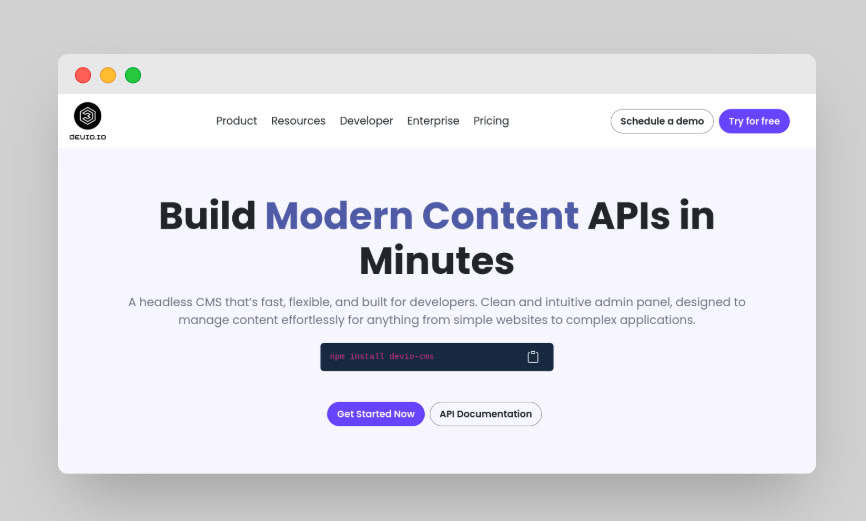
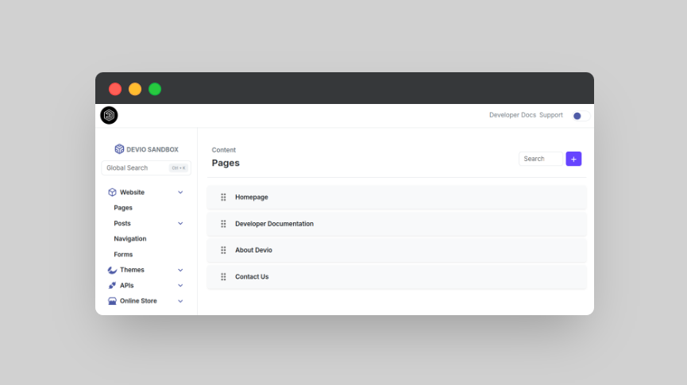
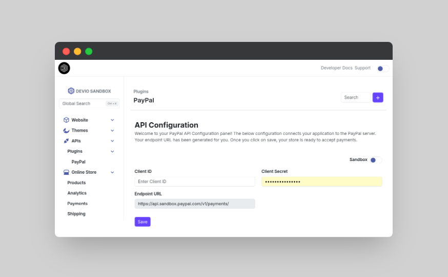

# 🚧 Devio Admin Panel Sandbox

**The modern admin panel for Devio — an open-source headless CMS built for speed, structure, and scalability.**

Devio is a headless CMS platform inspired by WordPress' plugin ecosystem. Headless CMSs today help modernize development and improve frontend flexibility — but they’re often slower to build with than traditional platforms. Devio solves this with a plugin-driven architecture, making it plug-and-play for use cases like eCommerce, LMS, SaaS, and more.

Unlike other emerging plug-and-play CMS platforms — where all plugins are internally developed — Devio is designed to be a hub for indie developers to create, share, and monetize their own plugins. Think of it as the modern, headless WordPress for today's web builders.

## 🖼️ Project Previews

<p align="center">
  
  <br/>
  <em>✨ Devio Landing Page – Clean and intuitive UI</em>
</p>

<p align="center">
  
  <br/>
  <em>✨ Devio Admin Panel – Block-based UI with plugin backend</em>
</p>

<p align="center">
  
  <br/>
  <em>✨ Devio Admin Panel – Block-based UI with plugin backend</em>
</p>

## ✨ Why This Exists

Most headless CMSs provide content modeling, but they stop short when it comes to **backend logic**. Dev teams need to re-implement backend logic such as cart, order-processing, authentication, and more.

Think:

* **Drag-and-drop block-based UI**
* **Schema-driven content modeling**
* **Plugin-powered backend workflows**
* **Instant preview and deploy-ready frontends**

This project is your entry point to shaping how headless CMS admin panels **should work** in 2025 and beyond.

---

## 🧱 Tech Stack

* **React** (Vite-powered)
* **Bootstrap**
* **Laravel**
* **GraphQL**
* **Devio API** (mocked endpoints for now)

---

## 🚀 Getting Started

```bash
git clone git@github.com:keatonmurray/devio-api-sandbox.git
cd /api
npm install
php artisan serve
cd /api/panel
npm install
npm run dev
```

> You’ll be running the Devio Admin Panel locally with mocked API endpoints. Real plugin integration coming soon.

---

## 🌍 Live Demo

We’re working on a live demo at: [sandbox.devio.app](https://sandbox.devio.app) *(coming soon)*

---

## 🛠️ Features

* ✅ Drag-and-drop page builder
* ✅ Content model creator
* ✅ Plugin mock system (auth, checkout, forms)
* ✅ Dark/light theme toggle
* ✅ Component-based layout system
* 🔜 Role-based permissions
* 🔜 Plugin marketplace UI

---

## 🧪 Roadmap

* [ ] Real-time backend plugin preview
* [ ] Inline API sandbox (like Swagger + Postman for plugins)
* [ ] One-click deploy to Vercel/Netlify
* [ ] Auth + RBAC integration
* [ ] Docs auto-generation from plugin schema
* [ ] Plugin versioning support

---

## 🤝 Contributing

We’re looking for contributors who want to **reimagine the CMS admin experience**. Designers, frontend devs, backend plugin creators — all are welcome.

### 📂 Good First Issues

* [ ] Component testing with Vitest
* [ ] Plugin card UI design
* [ ] Plugin sandbox API stubs
* [ ] Content model validation rules

### 🧑‍💻 How to Contribute

```bash
git checkout -b contribution
npm run dev
```

Make your changes, commit, push to your fork, and open a Pull Request. Be sure to link to any related issue in your PR description.

---

## 💬 Join the Community

* 💬 [Discord](https://discord.gg/devio) — Discuss architecture, integrations, plugins
* 🐦 [Twitter](https://twitter.com/deviohq) — Get updates

---

## 📄 More Info

Contact me at murraykeaton422@gmail.com

---

## 📄 License

MIT © [Keaton Murray](https://github.com/keatonmurray)

Devio is an ongoing open-source project — contributions and  discussions welcome.

---

> “Everything WordPress got right — but decoupled, developer-first, and ready for the modern stack.” 🚀
